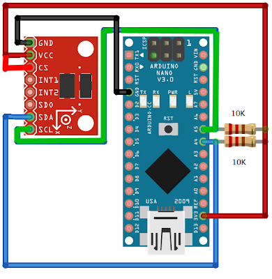

# accel-ADXL345 #

## Hardware Setup: ##

The following describes connecting for I2C communication
using an Arduino nano. The pull-up resistors are not needed
when dealing with an UNO.

| ADXL345 | Arduino        | Notes                |
| ------- | -------------- | -------------------- |
| GND     | GND            |                      |
| VCC     | 3.3V           |                      |
| CS      | 3.3V           |                      |
| INT1    | D2 (INT0)      | use Interrupts       |
| INT2    | -              |                      |
| SD0     | -              |                      |
| SDA     | A4 (SDA) blue  | 10k resistor to 3.3V |
| SCL     | A5 (SCL) green | 10k resistor to 3.3v |

  
Arduino Nano
