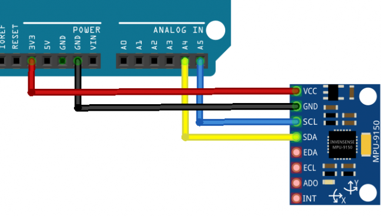

# Accel MPU9250 #

## Hardware Setup: ##

| MPU9250 | Arduino     |
| ------- | ----------- |
| VCC     | 3.3V        |
| GND     | GND         |
| SDA     | A4          |
| SCL     | A5          |
| EDA     | -           |
| ECL     | -           |
| AD0     | -           |
| INT     | pin2 (INT0) |
| NCS     | -           |
| FSYNC   | -           |

