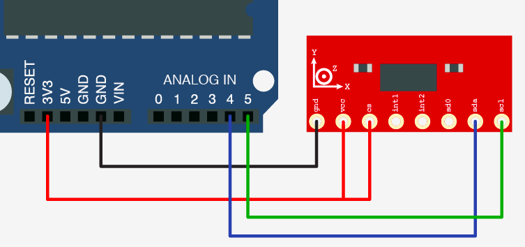

# accel-ADXL345 #

So far I am unable to get Interrupts to work

## Hardware Setup: ##

| ADXL345 | Arduino     |
| ------- | ----------- |
| GND     | GND         |
| VCC     | 5V          |
| CS      | 5V          |
| INT1    | pin2 (INT0) |
| INT2    | -           |
| SD0     | -           |
| SDA     | A4 (SDA)    |
| SCL     | A5 (SCL)    |

